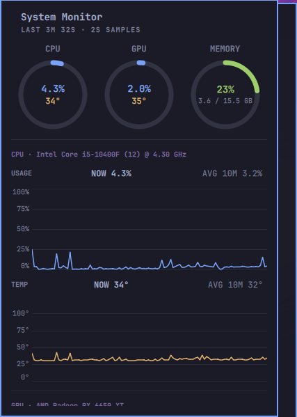

# omarchy-sysmon

Omarchy shell plugin (`wartafak.sysmon`): CPU / GPU / memory usage and
temperature in the top bar, with a popup showing current values, 10-minute
averages, and line-graph history.

## Screenshots

Bar widget (right side of the top bar):


Popup panel — summary rings, current values, 10-minute averages, and
history graphs (scroll for GPU / memory sections):



## Install

```bash
omarchy plugin add https://github.com/Wartafak/omarchy-sysmon.git --enable
```

Or manually:

```bash
git clone https://github.com/Wartafak/omarchy-sysmon.git ~/.config/omarchy/plugins/wartafak.sysmon
omarchy plugin enable wartafak.sysmon --section right
```

If QML edits don't appear, run `omarchy restart shell` (hot-reload does not
re-execute an already-loaded plugin).

## Remove

```bash
omarchy plugin remove wartafak.sysmon
```

## How it works

- `stats.sh` polls every 2s and prints one JSON line: CPU usage (`/proc/stat`),
  CPU temp (coretemp hwmon → thermal zone → `sensors`), memory (`/proc/meminfo`),
  GPU auto-detected (NVIDIA via `nvidia-smi` → AMD via `gpu_busy_percent` sysfs →
  Intel). Static labels (CPU model/threads/boost, short GPU name) are re-read
  each poll, so labels follow whatever hardware the host has.
- `BarWidget.qml` owns the poller and the 300-sample (10-minute) histories.
- `Panel.qml` renders current values, 10-minute averages, and Canvas line graphs.
- `Model.js` holds pure-JS helpers (tested with `node -e` against the module).
