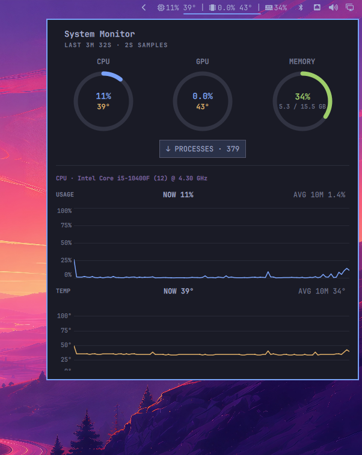
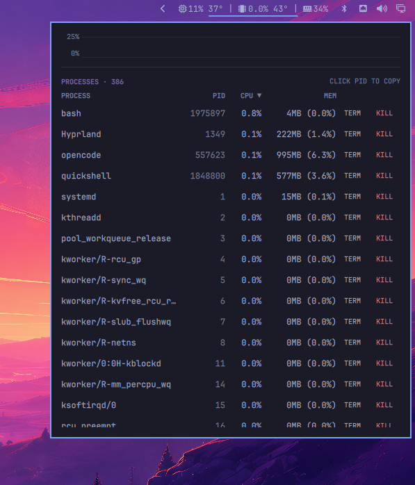

# omarchy-sysmon

Omarchy shell plugin (`wartafak.sysmon`): live CPU/GPU/memory stats with
history graphs in the top bar, plus a sortable process table with kill
actions.

## Screenshots

Bar widget (right side of the top bar) and popup — summary rings, current
values, 10-minute averages, and history graphs:



Process table — sortable, with click-to-copy PIDs and TERM/KILL actions:



## Features

Top bar (`BarWidget.qml`):

- Compact CPU / GPU / memory usage plus temperatures; the GPU readout
  hides itself when no GPU is detected
- Hover tooltip with current values and 10-minute averages
- Left-click toggles the popup, right-click forces a refresh

Popup (`Panel.qml`):

- Summary rings for CPU / GPU / memory with temperatures and GB detail
- Current values, 10-minute averages, and line-graph history per metric
- `↓ PROCESSES` jump button with a live process count
- Process table (top 25) sortable by process, PID, CPU, or memory
- Memory shown as absolute plus percent (`1.3GB (3.6%)`)
- Click a PID to copy it; TERM / KILL buttons per row
- Theme-aware colors following the active Omarchy theme

Under the hood:

- `stats.sh` polls system stats every 2s; `processes.sh` samples the
  process list every 2s but only while the popup is open
- Shared `Model.js`: all parsing, formatting, and ordering as pure,
  unit-tested functions (`node --test tests/`, no dependencies)
- `./tests/integration.sh`: live end-to-end test via shell IPC
- `debugState` IPC accessor for scripting and diagnosis

## Install

```bash
omarchy plugin add https://github.com/Wartafak/omarchy-sysmon.git --enable
```

Or manually:

```bash
git clone https://github.com/Wartafak/omarchy-sysmon.git ~/.config/omarchy/plugins/wartafak.sysmon
omarchy plugin enable wartafak.sysmon --section right
```

If QML edits don't appear, run `omarchy restart shell` (hot-reload does not
re-execute an already-loaded plugin).

## Remove

```bash
omarchy plugin remove wartafak.sysmon
```

## How it works

- `stats.sh` polls every 2s and prints one JSON line: CPU usage (`/proc/stat`),
  CPU temp (coretemp hwmon → thermal zone → `sensors`), memory (`/proc/meminfo`),
  GPU auto-detected (NVIDIA via `nvidia-smi` → AMD via `gpu_busy_percent` sysfs →
  Intel). Static labels (CPU model/threads/boost, short GPU name) are re-read
  each poll, so labels follow whatever hardware the host has.
- `BarWidget.qml` owns the pollers and the 300-sample (10-minute) histories.
- `Panel.qml` renders current values, 10-minute averages, Canvas line graphs,
  and the process table.
- `processes.sh` samples the process list every 2s, but only while the popup
  is open. CPU is the share of total capacity between two 0.5s-apart `/proc`
  snapshots (current usage — `ps` %CPU is a lifetime average); memory is the
  RSS share of `MemTotal`, shown as absolute plus percent (`1.3GB (3.6%)`,
  sorted by the absolute value). Per-process GPU usage is not exposed by
  AMD/Intel drivers, so the table sorts by CPU/memory/name only.
- Process rows offer TERM/KILL via `killproc.sh`, which validates its args
  (`TERM|KILL` + numeric pid, never pid 1) so QML can pass them as argv.
  Clicking a PID copies it to the clipboard (`wl-copy`, standard on
  Hyprland/Wayland).
- `Model.js` holds pure-JS helpers, shared by QML and the unit tests.
- `debugState` IPC accessor for scripting and diagnosis.

## Files

- `manifest.json` — id `wartafak.sysmon`, kind `bar-widget`
- `BarWidget.qml` — compact readout (BarWidget base) + pollers + histories
- `Panel.qml` — popup with summary rings, current values, averages, graphs,
  and the sortable process table (plus the `↓ PROCESSES` jump anchor)
- `stats.sh` — 2s collector, prints one JSON line per poll
- `processes.sh` — 2s process sampler (while open), prints one JSON array
- `killproc.sh` — validated `TERM|KILL <pid>` helper for the table buttons
- `Model.js` — pure helpers (parsing, history, formatting, graph mapping,
  process parse/sort), shared by QML and the unit tests
- `tests/model.test.js` — unit tests, no dependencies
- `tests/integration.sh` — helper schema tests + live end-to-end via shell IPC

## Testing

All display decisions live in `Model.js` as dependency-free functions,
imported by `BarWidget.qml`/`Panel.qml` (`import "Model.js" as Model`) and
by Node directly — so the same code that runs in the shell runs under
test.

```bash
omarchy plugin validate ~/.config/omarchy/plugins/wartafak.sysmon
node --test tests/   # 50 unit tests, no runner to install
./tests/integration.sh  # static helper checks always; live shell checks
                        # need omarchy-shell running (restart it after QML
                        # edits: hot-reload does not re-execute plugins)
```

The integration test validates the `stats.sh` JSON schema and value ranges
(cpu/gpu/mem 0–100 or null, sane temps, `mem_used <= mem_total`, known
`gpu_vendor`), the `processes.sh` array (row shape, ranges, cpu-desc order),
and `killproc.sh` arg validation (including a real TERM + KILL against
`sleep` processes it spawns itself), then — when the live shell is
available — drives the real widget through quickshell's native IPC
(`quickshell --path /usr/share/omarchy/shell ipc call wartafak.sysmon …`)
and the `debugState` accessor, asserting bounded histories, a callable
`refresh`, a populated process list while open, and an open/close/toggle
round-trip that ends with the panel closed.
